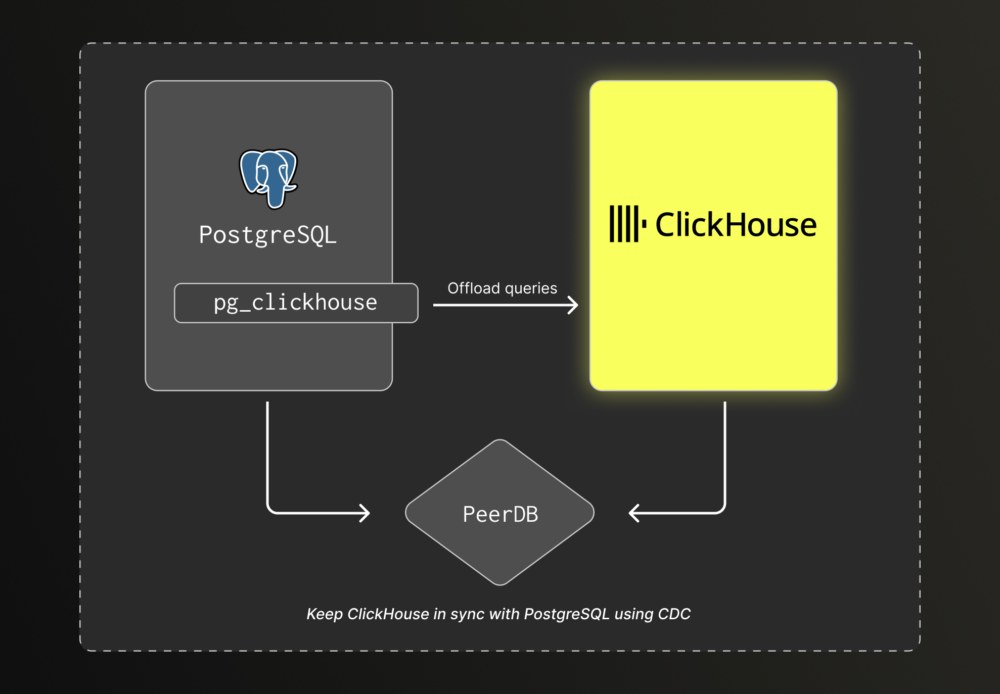
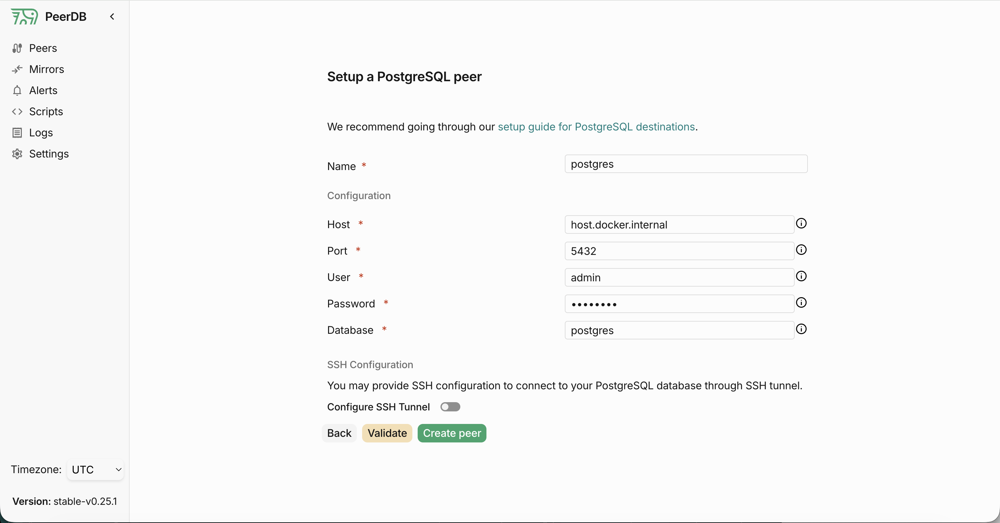
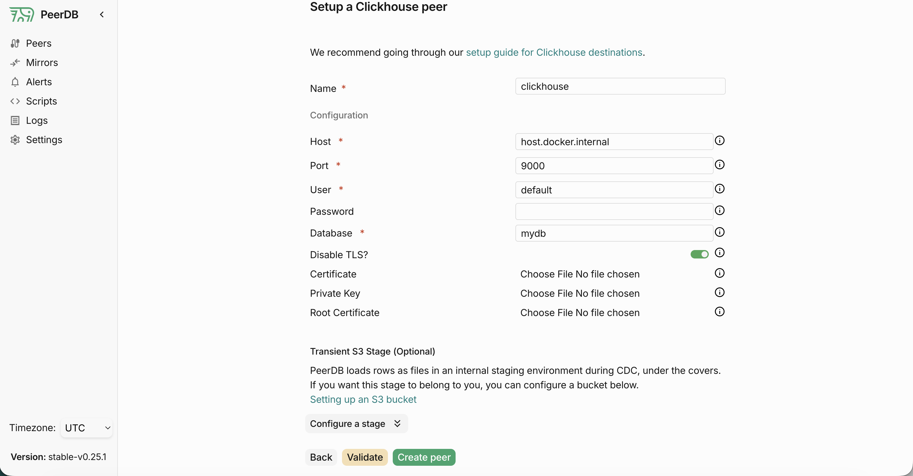
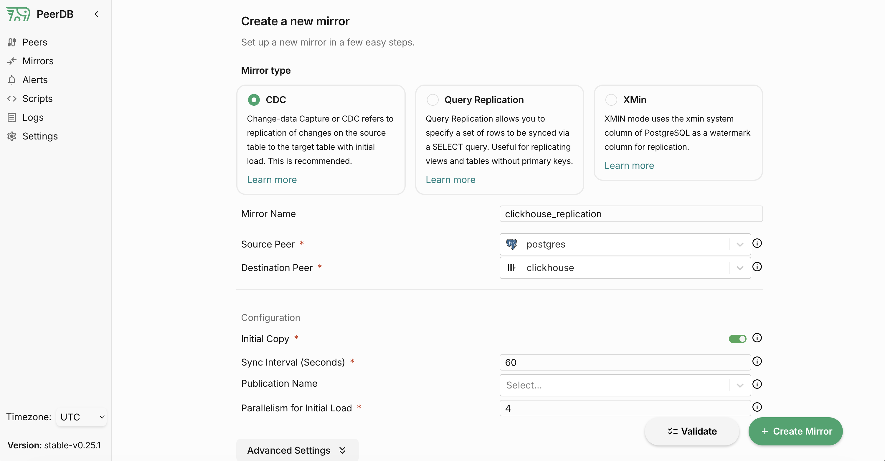
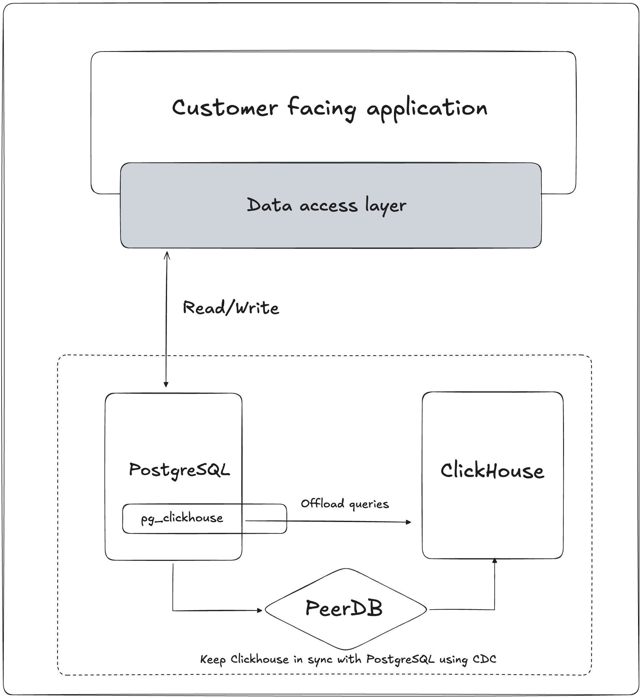

[](https://opensource.org/licenses/Apache-2.0)

# PostgreSQL + ClickHouse = The default Open Source Unified Data Stack

This repository provides a ready-to-use open source data stack that combines PostgreSQL and ClickHouse to handle transactional and analytical workloads.

PostgreSQL remains the primary database for transactional workloads and acts as the source of truth for application data. PeerDB streams data changes to ClickHouse using CDC, keeping it in sync near real time for analytics. The included pg_clickhouse extension allows PostgreSQL to transparently offload analytical queries to ClickHouse.

This data stack is intended for applications built on PostgreSQL that need scalable, low-latency analytics as data volume grows, without rewriting application code or building custom pipelines.

## What this stack includes

### PostgreSQL
- OLTP database
- Source of truth for application data
- Comes with the pg_clickhouse extension pre-installed

### ClickHouse
- OLAP database
- Optimized for large-scale aggregations and reporting queries

### PeerDB
- CDC-based replication from PostgreSQL to ClickHouse

## Getting started

### Prerequisites

**Required**
- Docker Engine with Docker Compose

### Clone this repository

```bash
git clone git@github.com:ClickHouse/postgres-clickhouse-stack.git
cd postgres-clickhouse-stack
```

### Start the Stack

```bash
make start
```

This will start the following services:
- PostgreSQL (port 5432)
- ClickHouse (ports 9000, 8123)
- PeerDB UI (port 3000)

### Stop the stack

```bash
make stop
```

### Access the services

- PeerDB UI: http://localhost:3000
- ClickHouse UI: http://localhost:8123/play
- ClickHouse Client: `clickhouse client --host 127.0.0.1 --port 9000`
- PostgreSQL: `psql -h localhost -p 5432 -U admin -d postgres` (password: `password`)

## Why this setup

PostgreSQL is an excellent choice as a primary database for an application, but analytical queries such as dashboards, reports, and ad-hoc exploration become slower and more expensive as data volumes increase. Using a purpose-built analytical database such as ClickHouse is a better fit for these use cases.

This stack separates concerns:
- PostgreSQL handles transactions, writes, and point queries.
- ClickHouse handles aggregations and analytical workloads.
- PeerDB keeps both systems in sync in near real time.
- pg_clickhouse allows PostgreSQL to transparently offload eligible queries to ClickHouse.

The result is a simple architecture that scales analytics without disrupting the application.

## Typical workflow

1. An application writes all data to PostgreSQL.
2. PeerDB streams changes from PostgreSQL to ClickHouse using CDC.
3. Analytical tables are maintained in ClickHouse.
4. Reporting and analytics queries run on ClickHouse.
5. When using pg_clickhouse, some analytical queries issued to PostgreSQL are automatically offloaded to ClickHouse.

From the application’s point of view, PostgreSQL remains the primary interface.

## Architecture



- **PostgreSQL**: Source of truth for transactional data
- **PeerDB**: CDC pipeline for real-time replication
- **ClickHouse**: Analytical store for fast aggregations
- **pg_clickhouse**: Transparent query offloading from PostgreSQL to ClickHouse


## How to use the stack

Using the stack with your own application is very simple.

Assuming PostgreSQL is the primary database of your application, start by connecting it to the PostgreSQL instance running in the container.

Next, identify the tables most commonly used for analytical queries and replicate them to ClickHouse using PeerDB. Finally, configure the ClickHouse foreign data wrapper with pg_clickhouse to offload analytical queries from PostgreSQL to ClickHouse.

### Connect to PostgreSQL 

The first step is to connect to the PostgreSQL instance running in the container. 

Configure your application to connect to the PostgreSQL instance using this configuration: 
- Host: localhost
- Port: 5432
- Username: admin
- Password: password
- Database: postgres

### Create the ClickHouse database

The next step is to create the ClickHouse database where the replicated tables will be stored. 

```bash
clickhouse client --host 127.0.0.1 --port 9000 --query "CREATE DATABASE IF NOT EXISTS mydb"
```

### Replicate data from PostgreSQL to ClickHouse

[PeerDB documentation](https://docs.peerdb.io/mirror/cdc-pg-clickhouse) provides a detailed guide on how to configure peers to replicate data from PostgreSQL to ClickHouse.

First start by creating two peers, one for PostgreSQL and one for ClickHouse. 

This can be done using the PeerDB UI or the PeerDB API. 

#### PostgreSQL Peer

To configure the PostgreSQL peer, use the following information:

- Name: `postgres`
- Host: `host.docker.internal`
- Port: `5432`
- User: `admin`
- Password: `password`
- Database: `postgres`



#### ClickHouse Peer

To configure the ClickHouse peer, use the following information:

- Name: `clickhouse`
- Host: `host.docker.internal`
- Port: `9000`
- User: `default`
- Password: `password`
- Database: `mydb`



#### Configure Mirror replication

Once the peers are created, you can configure the mirror replication. You have the choice between different replication strategies. When replicating from PostgreSQL to ClickHouse, we recommend using the `CDC` replication strategy.

You will need the following informations to configure the mirror replication:

- Name: 'clickhouse_replication'
- Source Peer: `postgres`
- Target Peer: `clickhouse`
- Replication Strategy: `CDC`

Then select the tables you want to replicate from PostgreSQL to ClickHouse. Check the target table name in ClickHouse, it's best if it matches the source table name so we can leverage the schema import feature of pg_clickhouse.



### Configure ClickHouse Foreign Data Wrapper

[pg_clickhouse documentation](https://github.com/ClickHouse/pg_clickhouse/blob/main/doc/tutorial.md) provides a detailed guide on how to configure the ClickHouse foreign data wrapper with pg_clickhouse to offload analytical queries from PostgreSQL to ClickHouse.

Below is an example of how you would configure pg_clickhouse in PostgreSQL to offload analytical queries to ClickHouse for the database `mydb`.

```sql
CREATE EXTENSION IF NOT EXISTS pg_clickhouse;
CREATE SERVER clickhouse_svr FOREIGN DATA WRAPPER clickhouse_fdw OPTIONS(dbname 'mydb', host 'host.docker.internal');
CREATE USER MAPPING FOR CURRENT_USER SERVER clickhouse_svr OPTIONS (user 'default', password '');
CREATE SCHEMA IF NOT EXISTS mydb_ch;
IMPORT FOREIGN SCHEMA mydb FROM SERVER clickhouse_svr INTO mydb_ch;
```

### Configure application to use ClickHouse for analytical queries

Once data is replicated from PostgreSQL to ClickHouse, the application can be configured to route analytical queries to ClickHouse. This is done by querying a dedicated PostgreSQL schema backed by pg_clickhouse.

The PostgreSQL client can be configured to use this schema by setting the search_path option in the connection string. In this project, the DB_SCHEMA environment variable is used to control this behavior. 

In this example, DB_SCHEMA is set to `mydb_ch`.

```typescript
const pool = new Pool({
  user: process.env.DB_USER || 'admin',
  host: process.env.DB_HOST || 'localhost',
  database: process.env.DB_NAME || 'postgres',
  password: process.env.DB_PASSWORD || 'password',
  port: parseInt(process.env.DB_PORT || '5432'),
  options: process.env.DB_SCHEMA
    ? `-c search_path=${process.env.DB_SCHEMA},public`
    : undefined,
});
```

#### Connect directly to ClickHouse

If you want the application to talk to ClickHouse directly, you can use any of the available ClickHouse client libraries. Changes on the application side should still be fairly simple as ClickHouse supports SQL queries that are compatible with PostgreSQL.

At a high level, the resulting architecture looks like this:



## Sample application 

The project includes a sample expense-tracking application to demonstrate the stack.

The application is built with Next.js and uses PostgreSQL as its primary database. It allows you to create expenses and view an analytics dashboard. On first startup, it seeds one million rows of sample data into PostgreSQL.

Initially, the analytics dashboard queries PostgreSQL directly and takes several seconds to load. Using this stack, data can be synchronized from PostgreSQL to ClickHouse via PeerDB, and analytical queries offloaded from PostgreSQL to ClickHouse using pg_clickhouse, reducing dashboard load times to milliseconds.

### Prerequisites

**Required**
- Node.js 20+ and npm
- PostgreSQL client tools 

### Start the application

```bash
make run-sample
```

Note that loading the sample data into PostgreSQL on the first run can take several minutes.

This will start the sample application at http://localhost:3001


### Set Up Data Replication

Run the migration script to migrate the data from PostgreSQL to ClickHouse using PeerDB and configure the ClickHouse Foreign Data Wrapper to offload the queries from PostgreSQL to ClickHouse using pg_clickhouse.

```bash
make migrate-sample
```

This will:
- Create the ClickHouse database
- Configure PeerDB peers
- Start data synchronization from PostgreSQL to ClickHouse
- Configure the ClickHouse Foreign Data Wrapper

Refresh the [analytics dashboard](http://localhost:3001/analytics) and you should see the load time drop from several seconds to milliseconds. 

With 10 million rows, the gap between PostgreSQL and ClickHouse is not very noticeable. On a typical setup, query time drops from around 2 seconds to about 300 ms, though exact numbers depend on your environment. To see a more significant difference, you can increase the number of rows by setting the `SEED_EXPENSE_ROWS` environment variable. I'd recommend setting it to at least 100M rows.
